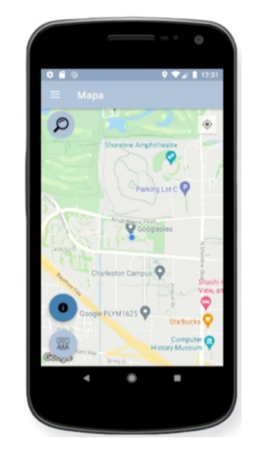

# SGD - Sistema de Gerenciamento Demográfico

**SGD** é um sistema mobile que informa a senso demográfico de estabelecimentos tais como: Restaurantes, Mercados e Shoppings. O desenvolvimento desse projeto ajuda a combater o grande problema que os estabelecimentos enfrentam durante quase todos os dias, que é a quantidade de pessoas que estão o frequentando. O aplicativo SGD ajuda o usuário que deseja ir em algum estabelecimento menos movimentado, pois o sistema o informa sobre a quantidade de pessoas que frequentaram aquele determinado local durante o dia, fazendo com que ele tenha uma base de informações sobre o local. Desse modo, o aplicativo SGD consegue satisfazer sua proposta inicial, mostrando aos usuários informações básicas sobre o local pesquisado, tendo como informação essencial a média demográfica dos estabelecimentos com escalas suportadas. 

## Recursos Principais

- **Informações sonbre senso demográfico de estabelecimentos**: Informações em tempo real sobre a quantidade de pessoas frequentando um determinado local, de acordo com os feedbacks recebidos.
- **Localização por GPS**: Utilize a localização do usuário por GPS para informar a sua localização no mapa.
- **Feedbacks sobre o senso demográfico**: Feedback sobre o senso demográfico do estabelecimento em que a pessoa se encontra.

# Sobre o Aplicativo

  
   
  <strong>
    Ao acessar o aplicativo de reciclagem, os usuários são recebidos pela tela inicial, onde encontram uma lista de tipos de materiais comuns, como plástico, papel,
    vidro e metal. Cada item da lista é representado por um ícone intuitivo e acompanhado por um breve título descritivo. Essa tela serve como ponto de partida para 
    os usuários escolherem o material específico que desejam aprender a reciclar.
  </strong>
    

  
   
  <strong>
  Após selecionarem um tipo de material na tela inicial, os usuários são direcionados para uma tela dedicada àquele material específico. Aqui, eles encontram
  informações detalhadas sobre como reciclar corretamente o material selecionado. Isso pode incluir instruções sobre os tipos de produtos feitos com esse
  material, como prepará-lo para reciclagem e quais recipientes ou sistemas de coleta são mais apropriados.
  </strong>
    

  
   
  <strong>
  Nesta tela, o aplicativo pede permissão para acessar a localização do usuário. Em seguida, mostra uma lista simples de pontos de reciclagem próximos, exibindo o
  título, endereço e distância de cada ponto em relação à localização do usuário. Ao tocar em um dos cards da lista, os usuários são direcionados para o mapa do google,
  podendo assim obter a melhor rota até o endereço selecionado. Essa abordagem mantém a interface limpa e fácil de usar, facilitando a localização de pontos de
  reciclagem.
  </strong>
    

  
   
  <strong>
  Na última tela do aplicativo, os usuários têm acesso a uma seção de perguntas frequentes e dicas sobre como reciclar de forma eficaz. Aqui, eles podem encontrar
  respostas para dúvidas comuns. Além disso, são fornecidas dicas úteis, como a importância de lavar os recipientes antes de reciclá-los para evitar contaminação e
  garantir a qualidade dos materiais reciclados.
  </strong>

