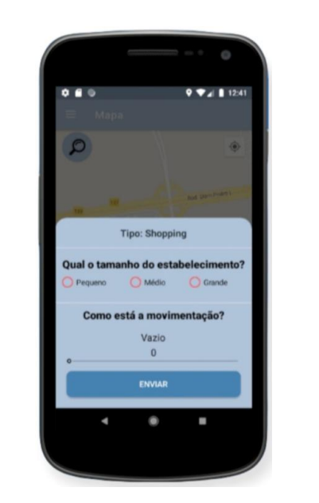

# SGD - Sistema de Gerenciamento Demográfico

**SGD** é um sistema mobile que informa a senso demográfico de estabelecimentos tais como: Restaurantes, Mercados e Shoppings. O desenvolvimento desse projeto ajuda a combater o grande problema que os estabelecimentos enfrentam durante quase todos os dias, que é a quantidade de pessoas que estão o frequentando. O aplicativo SGD ajuda o usuário que deseja ir em algum estabelecimento menos movimentado, pois o sistema o informa sobre a quantidade de pessoas que frequentaram aquele determinado local durante o dia, fazendo com que ele tenha uma base de informações sobre o local. Desse modo, o aplicativo SGD consegue satisfazer sua proposta inicial, mostrando aos usuários informações básicas sobre o local pesquisado, tendo como informação essencial a média demográfica dos estabelecimentos com escalas suportadas. 

## Recursos Principais

- **Informações sonbre senso demográfico de estabelecimentos**: Informações em tempo real sobre a quantidade de pessoas frequentando um determinado local, de acordo com os feedbacks recebidos.
- **Localização por GPS**: Utilize a localização do usuário por GPS para informar a sua localização no mapa.
- **Feedbacks sobre o senso demográfico**: Feedback sobre o senso demográfico do estabelecimento em que a pessoa se encontra.

# Sobre o Aplicativo

  <table style="margin: 0 auto;">
    <tr>
      <td></td>
      <td></td>
      <td></td>
    </tr>
    <tr>
      <td></td>
      <td></td>
      <td></td>
    </tr>
    <tr>
      <td></td>
      <td></td>
      <td></td>
    </tr>
  </table>

